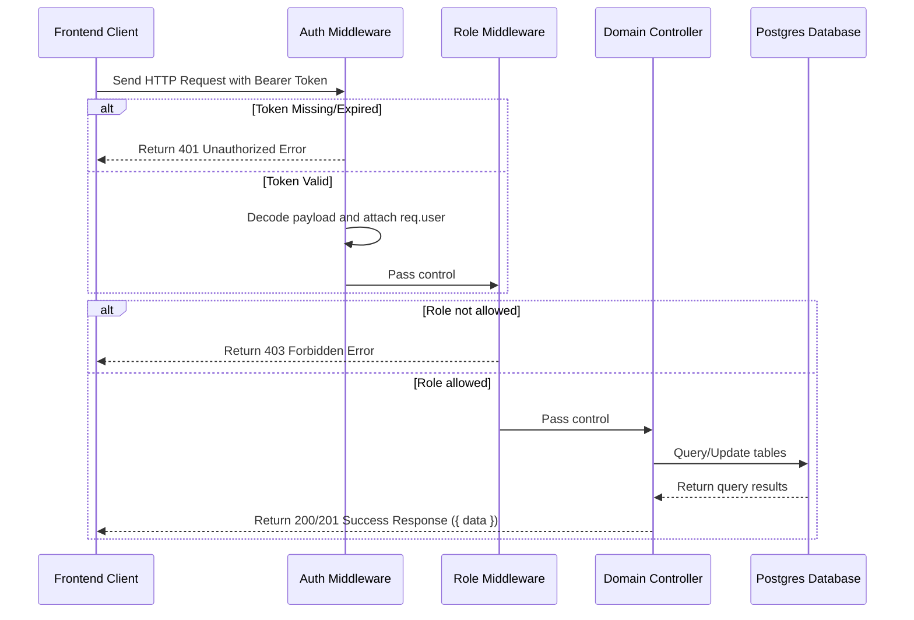

# System Architecture — Mini ERP + CRM Portal

This document explains the architecture of the Mini ERP + CRM Operations Portal.

---

## 1. Directory Structure

The project is structured as a monorepo with separate `backend` (Express.js, TypeScript, Prisma) and `frontend` (React, Vite, TypeScript, Tailwind CSS) components:

- **/backend**: Core business service and API server.
  - `/prisma`: Relational database schema definition (`schema.prisma`) and default data seeder (`seed.ts`).
  - `/src/middleware`: Global request validation, role authorization, and centralized error parsing.
  - `/src/modules`: Modular backend layers divided by domains:
    - `auth`: Credentials verification and JWT signing.
    - `customers`: CRM client profiles and follow-up activities.
    - `products`: Product catalogs and inventory logs.
    - `challans`: Transaction-based delivery challans.
- **/frontend**: Client UI built with React + Vite.
  - `/src/api`: Typed REST API client wrapping fetch operations.
  - `/src/context`: Authentication session wrapper (`AuthContext.tsx`).
  - `/src/components`: Layout widgets, sidebar drawer, protected routes, and custom notification toasts.
  - `/src/pages`: Functional views (Dashboard, Customers directory, Product list, and Challan invoices).
- **/docs**: Setup, testing, and architecture documentation.

---

## 2. Request & Authentication Flow

---

## 3. Database Schema

The database uses PostgreSQL with the following core tables:

1. **User**: Stores employee email, password hashes (bcryptjs), and roles (`ADMIN`, `SALES`, `WAREHOUSE`, `ACCOUNTS`).
2. **Customer**: CRM business data, types (`RETAIL`, `WHOLESALE`, `DISTRIBUTOR`), statuses (`LEAD`, `ACTIVE`, `INACTIVE`), and follow-up notes.
3. **CustomerFollowUpNote**: Chronological text notes mapped to customers, tracking the author (User) and timestamps.
4. **Product**: Catalog records holding unique SKUs, categories, pricing, current inventory levels, and low-stock alert thresholds.
5. **StockMovementLog**: Audit trail tracking all inventory changes (Manual stock adjustments, seed imports, or Sales Challan confirmations).
6. **Challan**: Sales delivery records tracking customer, total cost, total quantity, and statuses (`DRAFT`, `CONFIRMED`, `CANCELLED`).
7. **ChallanLineItem**: Items sold. Stores a product snapshot (`productName`, `productSku`, `priceAtSale`) alongside the `productId` to guarantee invoice integrity if products are edited in the future.

---

## 4. Transaction & Inventory Allocation Logic

One of the core requirements is ensuring that stock never goes negative and historical sales challans remain unmodified when product prices or names change.

### Stock SNAPSHOT Design
When a Challan is generated, the catalog `name`, `sku`, and current `unitPrice` are duplicated directly into the `ChallanLineItem` record as a snapshot. If a product is updated later (e.g. its price changes), previous invoices retrieve snapshot data rather than querying active catalog rows, preserving financial audit accuracy.

### DRAFT / CONFIRMED / CANCELLED States
- **Draft:** Creating a Draft Challan does not decrement stock or write movement logs. It is a staging state.
- **Confirmed:** Converting a Draft to Confirmed or creating a Confirmed Challan triggers a database transaction that:
  1. Compares requested quantities against available stock in the database.
  2. If any items have insufficient quantities, the transaction aborts (releasing locks) and returns a `409 Conflict` status identifying the short items.
  3. If stock is sufficient, it decrements stock sequentially using a conditional where statement (`where: { id: productId, currentStock: { gte: quantity } }`). This double checks that stock levels didn't change mid-execution, preventing race conditions.
  4. Writes stock movement logs (Movement: `OUT`, Reason: "Sales Challan #CH-YYYY-XXXX").
  5. Updates Challan status to `CONFIRMED`.
- **Cancelled:** Cancelling a Confirmed challan performs a restock operation in a transaction:
  1. Increments product stocks by original line item quantities.
  2. Writes stock movement logs (Movement: `IN`, Reason: "Restocked from Cancelled Sales Challan #CH-YYYY-XXXX").
  3. Updates Challan status to `CANCELLED`.
